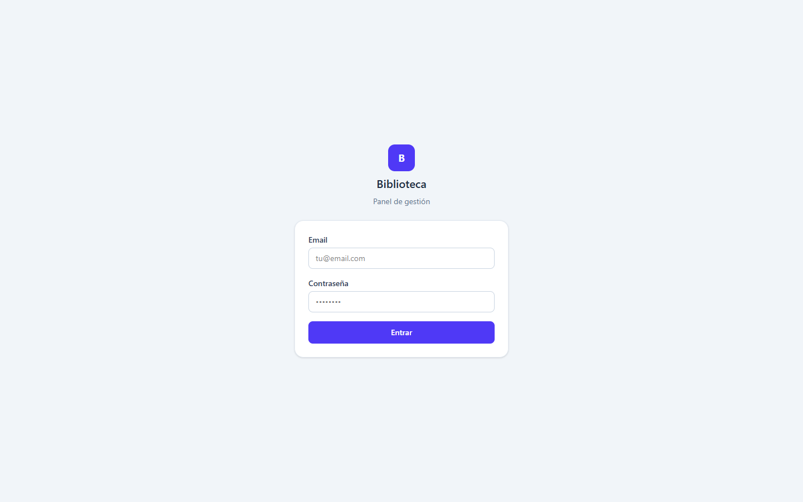
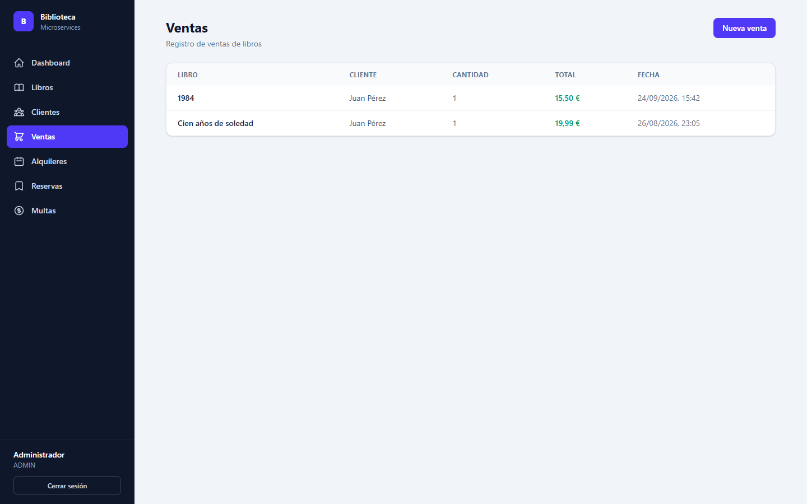
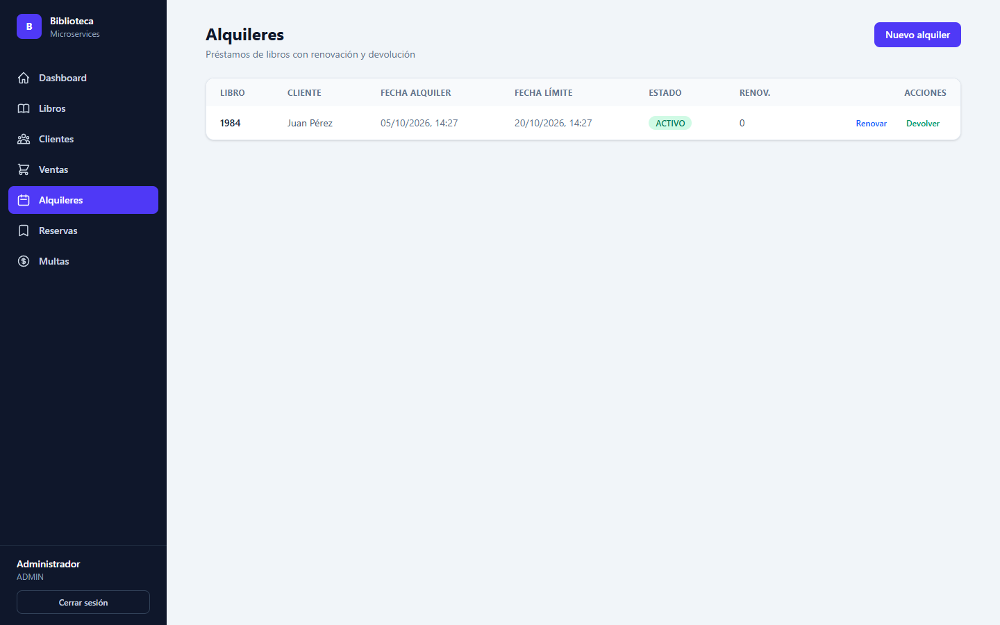
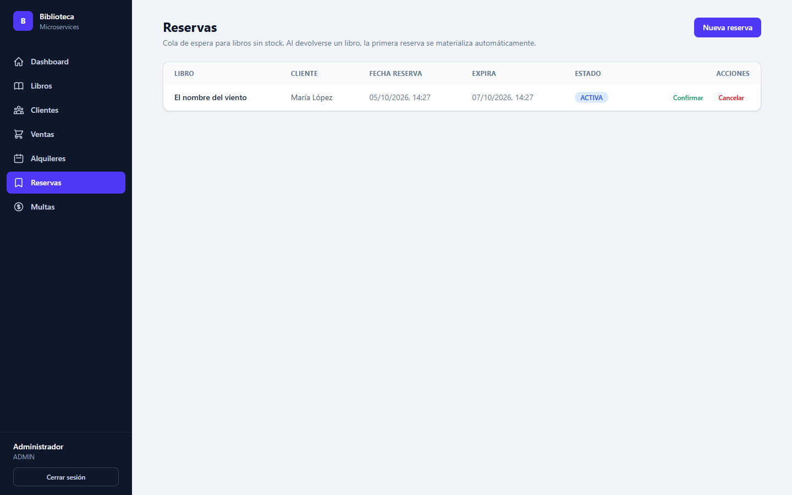

# Biblioteca Frontend


[](LICENSE)

Panel de gestión web para el sistema de microservicios de la biblioteca (Spring Cloud). Frontend en **React + Vite + Tailwind CSS** que consume la API a través del **gateway-service** (`localhost:8080`).

## Capturas

| Login | Dashboard |
|---|---|
|  |  |

| Libros | Ventas |
|---|---|
|  |  |

| Alquileres | Reservas |
|---|---|
|  |  |

## Funcionalidades

- **Login**: autenticación contra auth-service; el JWT se guarda en el navegador y se envía en cada petición
- **Dashboard**: KPIs del sistema (libros, stock, clientes, ventas e ingresos, alquileres activos, multas pendientes, reservas)
- **Libros**: CRUD completo, búsqueda por título/autor/ISBN y ajuste de stock
- **Clientes**: CRUD completo
- **Ventas**: registro de ventas (valida stock disponible)
- **Alquileres**: préstamos, renovación (máx 2) y devolución con multa automática por retraso
- **Reservas**: cola de espera para libros sin stock, confirmación y cancelación (materialización automática al devolver el libro)
- **Multas**: listado y registro de pagos

## Autenticación y roles

- `/login` es la única ruta pública; el resto redirige a ella si no hay sesión
- El token se guarda en `localStorage` (`biblioteca.sesion`) y `api.js` lo añade como `Authorization: Bearer ...`
- Si el backend responde `401` (token caducado o inválido), se borra la sesión y se vuelve al login
- **ADMIN** y **BIBLIOTECARIO** ven todas las secciones; **CLIENTE** solo ve el catálogo de libros (en modo lectura)
- El menú y los botones de escritura se ocultan según el rol, y las rutas de personal están protegidas con `RutaProtegida`

## Arquitectura

- Las peticiones van a `/api/...`:
  - **Desarrollo**: proxy de Vite hacia `http://localhost:8080`
  - **Producción**: nginx sirve el build y proxifica `/api` hacia el gateway
- Backend: catálogo, transacciones, clientes, auth, discovery (Eureka) y gateway (Spring Cloud Gateway)

## Requisitos

- Node.js 20+
- Stack de microservicios levantado (ver `biblioteca-deploy`) con el gateway en `localhost:8080`

## Desarrollo

```bash
npm install
npm run dev        # http://localhost:5173
```

## Producción (Docker)

```bash
docker build -t biblioteca-frontend .
docker run -p 3000:80 biblioteca-frontend   # http://localhost:3000
```

O directamente con docker-compose desde `biblioteca-deploy`:

```bash
docker compose up -d frontend
```

## Estructura

```
src/
├── api.js                  # Cliente HTTP (token + manejo de 401) y utilidades de formato
├── auth.jsx                # AuthContext: sesión, login, logout y rol
├── components/             # Layout, RutaProtegida, Modal, Badge, Toast, ConfirmDialog, Spinner...
└── pages/                  # Login, Dashboard, Libros, Clientes, Ventas, Alquileres, Reservas, Multas
```
